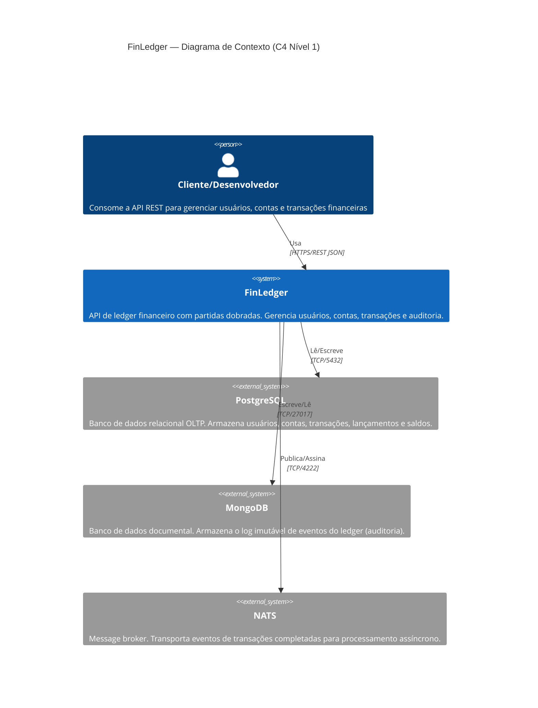

# Nível 1 — Diagrama de Contexto

Mostra o sistema FinLedger e seus atores/sistemas externos.

```mermaid
C4Context
    title FinLedger — Diagrama de Contexto (C4 Nível 1)

    Person(user, "Cliente/Desenvolvedor", "Consome a API REST para gerenciar usuários, contas e transações financeiras")

    System(finledger, "FinLedger", "API de ledger financeiro com partidas dobradas. Gerencia usuários, contas, transações e auditoria.")

    System_Ext(postgres, "PostgreSQL", "Banco de dados relacional OLTP. Armazena usuários, contas, transações, lançamentos e saldos.")
    System_Ext(mongodb, "MongoDB", "Banco de dados documental. Armazena o log imutável de eventos do ledger (auditoria).")
    System_Ext(nats, "NATS", "Message broker. Transporta eventos de transações completadas para processamento assíncrono.")

    Rel(user, finledger, "Usa", "HTTPS/REST JSON")
    Rel(finledger, postgres, "Lê/Escreve", "TCP/5432")
    Rel(finledger, mongodb, "Escreve/Lê", "TCP/27017")
    Rel(finledger, nats, "Publica/Assina", "TCP/4222")
```
