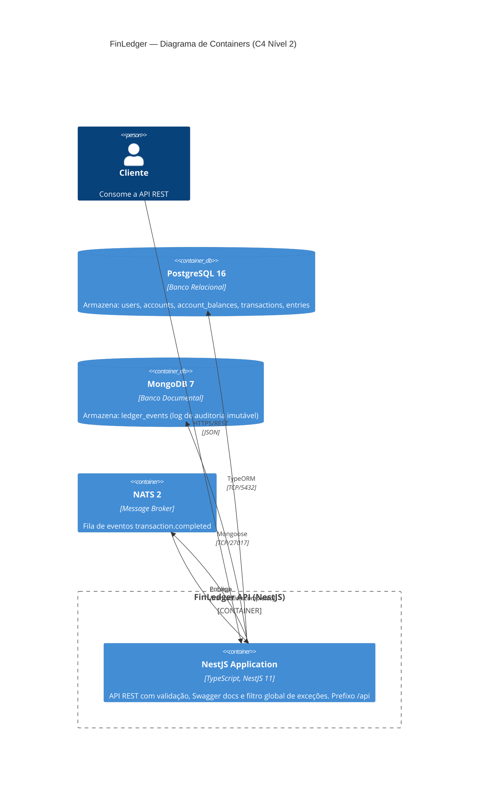

# Nível 2 — Diagrama de Containers

Detalha os containers (processos/serviços deployáveis) que compõem o sistema.

```mermaid
C4Container
    title FinLedger — Diagrama de Containers (C4 Nível 2)

    Person(user, "Cliente", "Consome a API REST")

    Container_Boundary(api, "FinLedger API (NestJS)") {
        Container(nestapp, "NestJS Application", "TypeScript, NestJS 11", "API REST com validação, Swagger docs e filtro global de exceções. Prefixo /api")
    }

    ContainerDb(postgres, "PostgreSQL 16", "Banco Relacional", "Armazena: users, accounts, account_balances, transactions, entries")
    ContainerDb(mongodb, "MongoDB 7", "Banco Documental", "Armazena: ledger_events (log de auditoria imutável)")
    Container(nats, "NATS 2", "Message Broker", "Fila de eventos transaction.completed")

    Rel(user, nestapp, "HTTPS/REST", "JSON")
    Rel(nestapp, postgres, "TypeORM", "TCP/5432")
    Rel(nestapp, mongodb, "Mongoose", "TCP/27017")
    Rel(nestapp, nats, "Publica", "transaction.completed")
    Rel(nats, nestapp, "Entrega", "transaction.completed")
```
