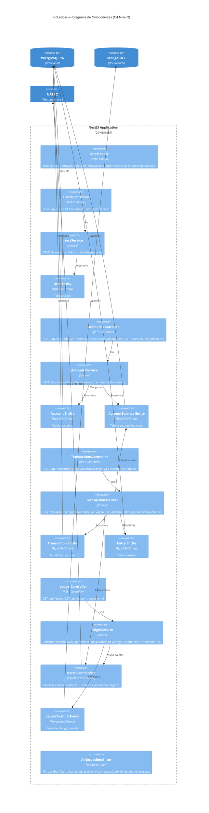

# Nível 3 — Diagrama de Componentes

Detalha os módulos internos do container NestJS Application.

```mermaid
C4Component
    title FinLedger — Diagrama de Componentes (C4 Nível 3)

    Container_Boundary(nestapp, "NestJS Application") {

        Component(appModule, "AppModule", "NestJS Module", "Módulo raiz. Configura TypeORM, Mongoose e importa todos os módulos de domínio.")

        Component(usersCtrl, "UsersController", "REST Controller", "POST /api/users, GET /api/users, GET /api/users/:id")
        Component(usersSvc, "UsersService", "Service", "CRUD de usuários. Valida unicidade de email.")
        Component(usersRepo, "User Entity", "TypeORM Entity", "Tabela users")

        Component(accountsCtrl, "AccountsController", "REST Controller", "POST /api/accounts, GET /api/accounts, GET /api/accounts/:id, GET /api/accounts/:id/balance")
        Component(accountsSvc, "AccountsService", "Service", "CRUD de contas. Cria conta + saldo zero em transação atômica.")
        Component(accountRepo, "Account Entity", "TypeORM Entity", "Tabela accounts")
        Component(balanceRepo, "AccountBalance Entity", "TypeORM Entity", "Tabela account_balances")

        Component(txCtrl, "TransactionsController", "REST Controller", "POST /api/transactions, GET /api/transactions, GET /api/transactions/:id")
        Component(txSvc, "TransactionsService", "Service", "Cria transações com partidas dobradas. Valida D=C, atualiza saldos, garante idempotência.")
        Component(txRepo, "Transaction Entity", "TypeORM Entity", "Tabela transactions")
        Component(entryRepo, "Entry Entity", "TypeORM Entity", "Tabela entries")

        Component(ledgerCtrl, "LedgerController", "REST Controller", "GET /api/ledger, GET /api/ledger/:transactionId")
        Component(ledgerSvc, "LedgerService", "Service", "Consome eventos NATS, persiste log de auditoria no MongoDB com retry e idempotência.")
        Component(natsClient, "NatsClientService", "Infrastructure Service", "Gerencia conexão com NATS. Publica e assina mensagens.")
        Component(ledgerSchema, "LedgerEvent Schema", "Mongoose Schema", "Collection ledger_events")

        Component(exFilter, "AllExceptionsFilter", "Exception Filter", "Filtro global. Padroniza respostas de erro com statusCode, timestamp e message.")
    }

    ContainerDb(postgres, "PostgreSQL 16", "Relacional")
    ContainerDb(mongodb, "MongoDB 7", "Documental")
    Container(nats, "NATS 2", "Message Broker")

    Rel(usersCtrl, usersSvc, "Usa")
    Rel(usersSvc, usersRepo, "Repository")
    Rel(usersRepo, postgres, "TypeORM")

    Rel(accountsCtrl, accountsSvc, "Usa")
    Rel(accountsSvc, accountRepo, "Repository")
    Rel(accountsSvc, balanceRepo, "Repository")
    Rel(accountRepo, postgres, "TypeORM")
    Rel(balanceRepo, postgres, "TypeORM")

    Rel(txCtrl, txSvc, "Usa")
    Rel(txSvc, txRepo, "Repository")
    Rel(txSvc, entryRepo, "Repository")
    Rel(txSvc, balanceRepo, "Atualiza saldo")
    Rel(txSvc, natsClient, "Emite evento")
    Rel(txRepo, postgres, "TypeORM")
    Rel(entryRepo, postgres, "TypeORM")

    Rel(ledgerCtrl, ledgerSvc, "Usa")
    Rel(ledgerSvc, ledgerSchema, "Mongoose")
    Rel(ledgerSvc, natsClient, "Assina eventos")
    Rel(natsClient, nats, "NATS Protocol")
    Rel(ledgerSchema, mongodb, "Mongoose")
```
