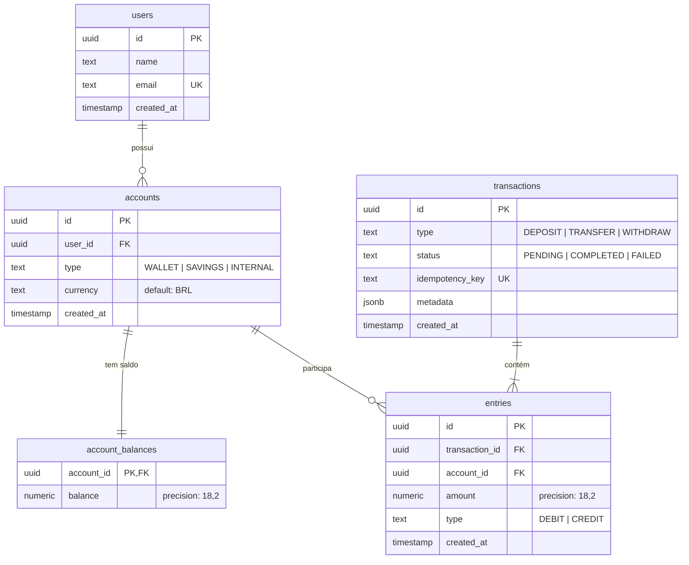
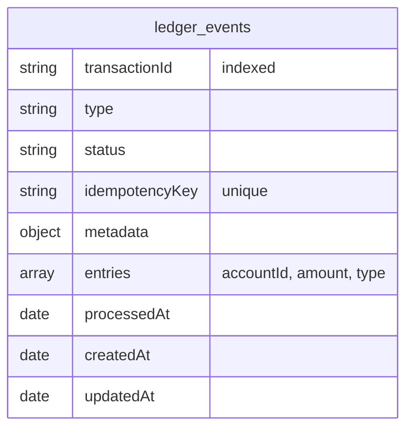

# Modelo de Dados

## PostgreSQL (OLTP)

```mermaid
erDiagram
    users {
        uuid id PK
        text name
        text email UK
        timestamp created_at
    }

    accounts {
        uuid id PK
        uuid user_id FK
        text type "WALLET | SAVINGS | INTERNAL"
        text currency "default: BRL"
        timestamp created_at
    }

    account_balances {
        uuid account_id PK,FK
        numeric balance "precision: 18,2"
    }

    transactions {
        uuid id PK
        text type "DEPOSIT | TRANSFER | WITHDRAW"
        text status "PENDING | COMPLETED | FAILED"
        text idempotency_key UK
        jsonb metadata
        timestamp created_at
    }

    entries {
        uuid id PK
        uuid transaction_id FK
        uuid account_id FK
        numeric amount "precision: 18,2"
        text type "DEBIT | CREDIT"
        timestamp created_at
    }

    users ||--o{ accounts : "possui"
    accounts ||--|| account_balances : "tem saldo"
    accounts ||--o{ entries : "participa"
    transactions ||--|{ entries : "contém"
```

## MongoDB (Auditoria)

```mermaid
erDiagram
    ledger_events {
        string transactionId "indexed"
        string type
        string status
        string idempotencyKey "unique"
        object metadata
        array entries "accountId, amount, type"
        date processedAt
        date createdAt
        date updatedAt
    }
```
