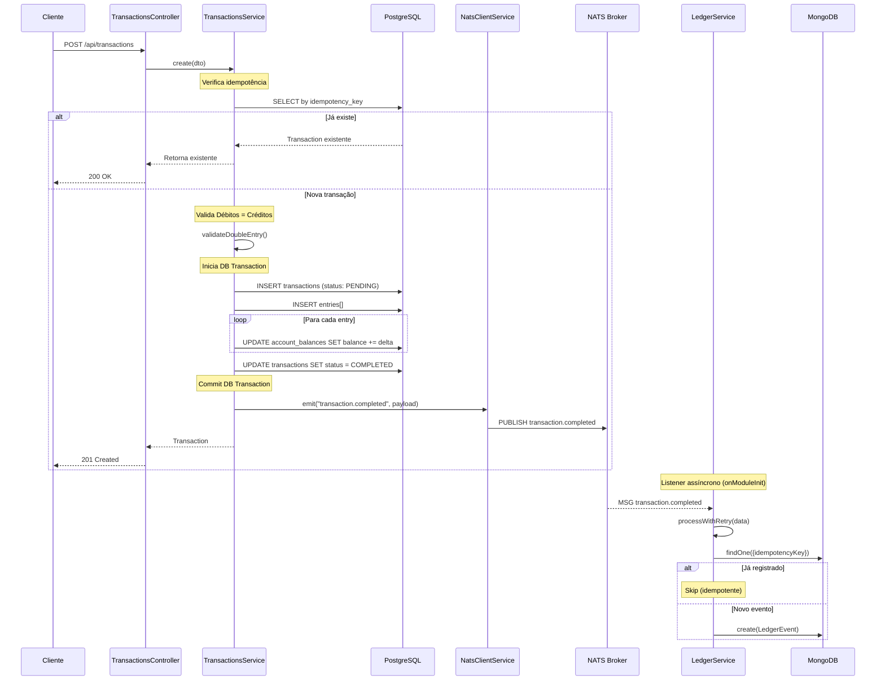
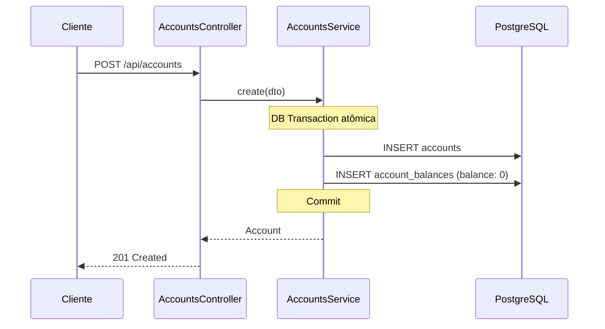

# Fluxos Principais

## Criação de Transação (Partidas Dobradas)

```mermaid
sequenceDiagram
    participant C as Cliente
    participant TC as TransactionsController
    participant TS as TransactionsService
    participant PG as PostgreSQL
    participant NC as NatsClientService
    participant NATS as NATS Broker
    participant LS as LedgerService
    participant MG as MongoDB

    C->>TC: POST /api/transactions
    TC->>TS: create(dto)

    Note over TS: Verifica idempotência
    TS->>PG: SELECT by idempotency_key
    alt Já existe
        PG-->>TS: Transaction existente
        TS-->>TC: Retorna existente
        TC-->>C: 200 OK
    else Nova transação
        Note over TS: Valida Débitos = Créditos
        TS->>TS: validateDoubleEntry()

        Note over TS: Inicia DB Transaction
        TS->>PG: INSERT transactions (status: PENDING)
        TS->>PG: INSERT entries[]
        loop Para cada entry
            TS->>PG: UPDATE account_balances SET balance += delta
        end
        TS->>PG: UPDATE transactions SET status = COMPLETED
        Note over TS: Commit DB Transaction

        TS->>NC: emit("transaction.completed", payload)
        NC->>NATS: PUBLISH transaction.completed

        TS-->>TC: Transaction
        TC-->>C: 201 Created
    end

    Note over LS: Listener assíncrono (onModuleInit)
    NATS-->>LS: MSG transaction.completed
    LS->>LS: processWithRetry(data)
    LS->>MG: findOne({idempotencyKey})
    alt Já registrado
        Note over LS: Skip (idempotente)
    else Novo evento
        LS->>MG: create(LedgerEvent)
    end
```

## Criação de Conta

```mermaid
sequenceDiagram
    participant C as Cliente
    participant AC as AccountsController
    participant AS as AccountsService
    participant PG as PostgreSQL

    C->>AC: POST /api/accounts
    AC->>AS: create(dto)
    Note over AS: DB Transaction atômica
    AS->>PG: INSERT accounts
    AS->>PG: INSERT account_balances (balance: 0)
    Note over AS: Commit
    AS-->>AC: Account
    AC-->>C: 201 Created
```
